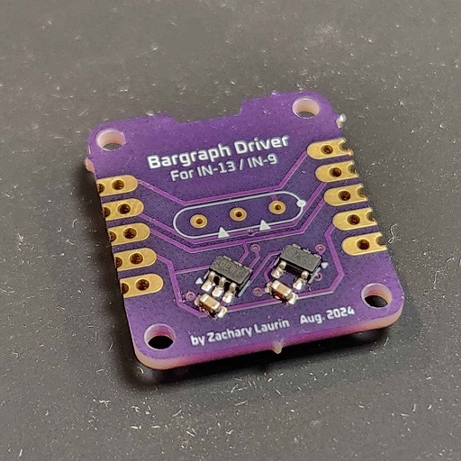
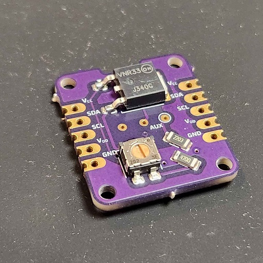

# Bargraph Driver

For IN-13 / IN-9 Neon Tubes

## Description

This is a small 21x24mm driver module PCB for a single IN-13 or IN-9 neon bargraph tube. It fits on a breadboard and multiple modules can be chained together with U-shaped headers. Each module has an 8-bit DAC with a fixed address, controlled via I2C. The potentiometer is used to adjust the maximum glow length. Here is four tubes acting as a (not very accurate) spectrum analyzer: https://www.youtube.com/shorts/-yOVEOMO8Xs

In the resources folder you will find the datasheet for the IN-13 as well as the font I used on the silkscreen. I have also included the BOM. I personally got all of the components from Mouser and the boards printed at OSHPark. To power the tubes I am using a [NCH6300HV](https://omnixie.com/products/nch6300hv-nixie-hv-power-module) and to control them an Arduino UNO with this [MCP47X6 library](https://github.com/uChip/MCP47X6).

### Notes

* The SDA pad is right next to the +150V one so watch out as to not accidentally short them when soldering.
* Although the MCP4706's datasheet says that there are eight addresses available, it seems most electronic suppliers only stock the first four. In my case I had to use two I2C buses to drive as many tubes as I wanted to.
* You need some sort of frame to hold the tubes in place. I recommend the use of wide tie wraps to keep them straight.

## Authors

Zachary Laurin

## Version History

* 0.1
    * Initial Release

## License

This project is licensed under the GNU GPLv3 License - see the LICENSE.md file for details

## Acknowledgments

Thanks a lot to the users of the Arduino, KiCad EDA and Nixie Tubes Discord servers as well as to the people of neonixie-l the EEVblog forum for their help.